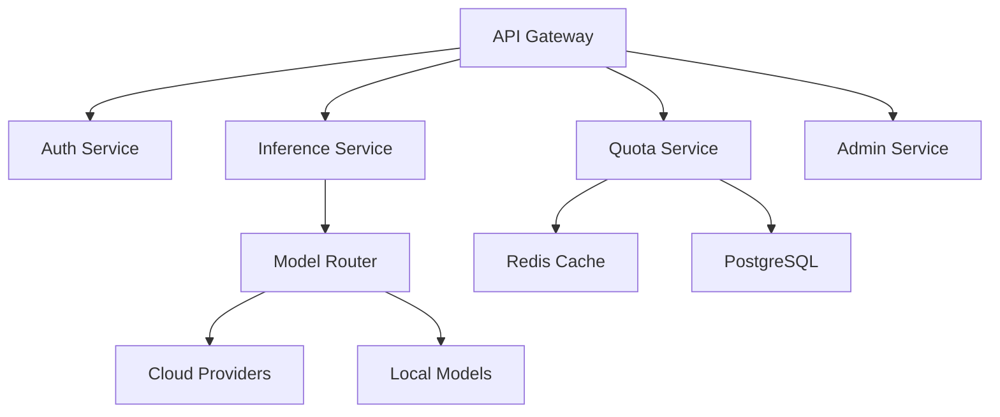

# LLM Backend Multi-tenant Architecture

## Overview

This document details the architecture for a scalable, secure, and efficient multi-tenant LLM backend system that provides access to various language models through a standardized OpenAI-compatible API.

## Core Architecture Components

### API Layer
- **FastAPI** for high-performance async API endpoints
- OpenAI-compatible API endpoints using Langchain
- Rate limiting middleware using Redis
- Authentication/Authorization middleware
- Request validation and sanitization
- Tenant context middleware

### Service Layer


### Database Architecture
- **PostgreSQL** for persistent storage
  - Separate database per tenant for complete isolation
  - Key schemas:
    - Users and roles
    - API keys and permissions
    - Usage tracking and quotas
    - Audit logs
    - Billing and invoicing

### Caching Layer
- **Redis** for:
  - Rate limiting
  - Token quota tracking
  - Session management
  - Request deduplication
  - Query caching

### Message Queue
- **Redis Streams** for:
  - Async task processing
  - Webhook notifications
  - Log aggregation
  - Event broadcasting

## Security Architecture

### Authentication & Authorization
1. Bearer token authentication
2. Role-based access control (RBAC)
3. Tenant isolation at database level
4. API key rotation and revocation
5. Request signing for webhook endpoints

### Security Measures
1. Request rate limiting per tenant/user
2. Input validation and sanitization
3. Audit logging of all sensitive operations
4. Encrypted data at rest and in transit
5. Regular security scanning and updates

## Monitoring & Observability

### Grafana Dashboards
1. **Operational Metrics**
   - Request latency
   - Error rates
   - API endpoint usage
   - Model performance

2. **Business Metrics**
   - Token consumption
   - Active users
   - Quota utilization
   - Cost per tenant

3. **System Metrics**
   - CPU/Memory usage
   - Network I/O
   - Cache hit rates
   - Database performance

### Logging Strategy
- Structured JSON logging
- Log levels: DEBUG, INFO, WARNING, ERROR
- Key log fields:
  - Tenant ID
  - Request ID
  - User ID
  - Model ID
  - Token count
  - Response time
  - Error details

### Alerting System
- Webhook notifications for:
  - Quota threshold reached
  - Error rate spikes
  - Unusual token consumption
  - System performance issues

## Scaling Strategy

### Horizontal Scaling
1. **API Layer**
   - Auto-scaling based on CPU/Memory
   - Load balancer distribution
   - Session affinity when needed

2. **Database Layer**
   - Read replicas per tenant
   - Connection pooling
   - Query optimization

3. **Cache Layer**
   - Redis cluster
   - Cache sharding
   - Eviction policies

### Vertical Scaling
- Instance size optimization based on workload
- Scheduled scaling for predictable loads
- Burst capacity planning

## Cost Optimization (FinOps)

### Cost Monitoring
1. **Resource Costs**
   - Infrastructure usage
   - API calls
   - Storage
   - Network transfer

2. **Model Costs**
   - Token consumption
   - Model API fees
   - Training costs

### Cost Control Measures
1. **Resource Optimization**
   - Auto-scaling limits
   - Cache optimization
   - Storage cleanup
   - Compression strategies

2. **Usage Optimization**
   - Token quotas
   - Request batching
   - Response caching
   - Model selection based on requirements

## Development Environment

### Docker Compose Stack
```yaml
services:
  api:
    build: .
    ports:
      - "8000:8000"
    depends_on:
      - postgres
      - redis
      - grafana

  postgres:
    image: postgres:latest
    environment:
      POSTGRES_PASSWORD: ${POSTGRES_PASSWORD}
      POSTGRES_DB: llm_backend
    volumes:
      - postgres_data:/var/lib/postgresql/data

  redis:
    image: redis:latest
    ports:
      - "6379:6379"

  grafana:
    image: grafana/grafana:latest
    ports:
      - "3000:3000"
    volumes:
      - grafana_data:/var/lib/grafana

  prometheus:
    image: prom/prometheus:latest
    ports:
      - "9090:9090"
    volumes:
      - ./prometheus.yml:/etc/prometheus/prometheus.yml

volumes:
  postgres_data:
  grafana_data:
```

## Project Structure

```
llm-backend/
├── docker/
│   ├── Dockerfile
│   └── docker-compose.yml
├── src/
│   ├── api/
│   │   ├── routes/
│   │   ├── middleware/
│   │   └── validators/
│   ├── services/
│   │   ├── auth/
│   │   ├── inference/
│   │   ├── quota/
│   │   └── admin/
│   ├── models/
│   │   ├── database/
│   │   └── domain/
│   ├── config/
│   └── utils/
├── tests/
│   ├── unit/
│   └── integration/
├── docs/
│   ├── api/
│   ├── development/
│   └── deployment/
└── scripts/
    ├── setup.sh
    └── deploy.sh
```

## CI/CD Pipeline

### GitHub Actions Workflow
```yaml
name: CI/CD

on:
  push:
    branches: [ main ]
  pull_request:
    branches: [ main ]

jobs:
  test:
    runs-on: ubuntu-latest
    steps:
      - uses: actions/checkout@v2
      - name: Set up Python
        uses: actions/setup-python@v2
      - name: Install dependencies
        run: pip install -r requirements.txt
      - name: Run tests
        run: pytest
      - name: Run linting
        run: flake8

  build:
    needs: test
    runs-on: ubuntu-latest
    steps:
      - uses: actions/checkout@v2
      - name: Build Docker image
        run: docker build -t llm-backend .
      - name: Push to registry
        run: docker push llm-backend

  deploy:
    needs: build
    runs-on: ubuntu-latest
    steps:
      - name: Deploy to production
        run: ./scripts/deploy.sh
```

## Open Source Guidelines

### Documentation
1. Comprehensive README.md
2. API documentation using OpenAPI/Swagger
3. Development setup guide
4. Contribution guidelines
5. Security policy
6. Code of conduct

### License
MIT License recommended for maximum adoption and flexibility

### Contribution Process
1. Fork repository
2. Create feature branch
3. Submit pull request
4. Code review
5. Automated testing
6. Merge to main

## Next Steps

1. **Infrastructure Setup**
   - Set up cloud resources
   - Configure monitoring
   - Establish CI/CD pipeline

2. **Core Development**
   - Implement authentication
   - Build model router
   - Create quota system
   - Develop admin panel

3. **Testing & Documentation**
   - Write unit tests
   - Create integration tests
   - Document API endpoints
   - Prepare deployment guides

4. **Security & Compliance**
   - Security audit
   - Performance testing
   - Load testing
   - Penetration testing