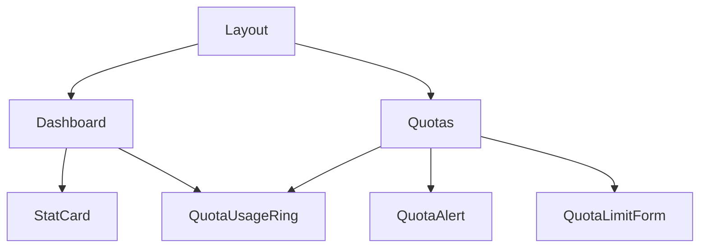
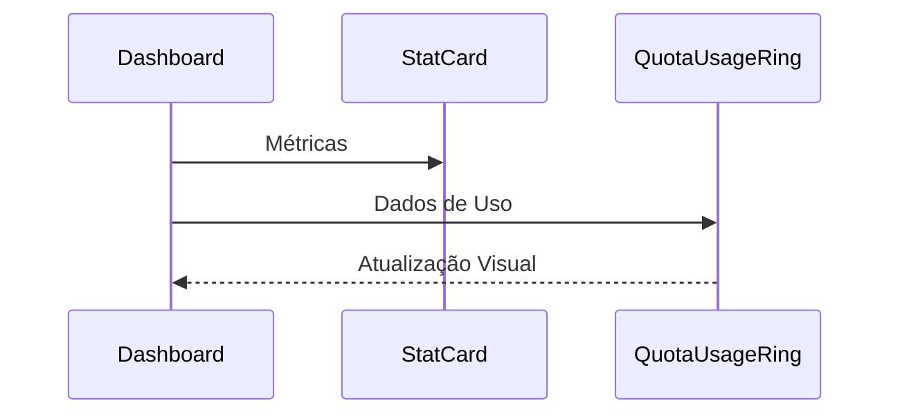
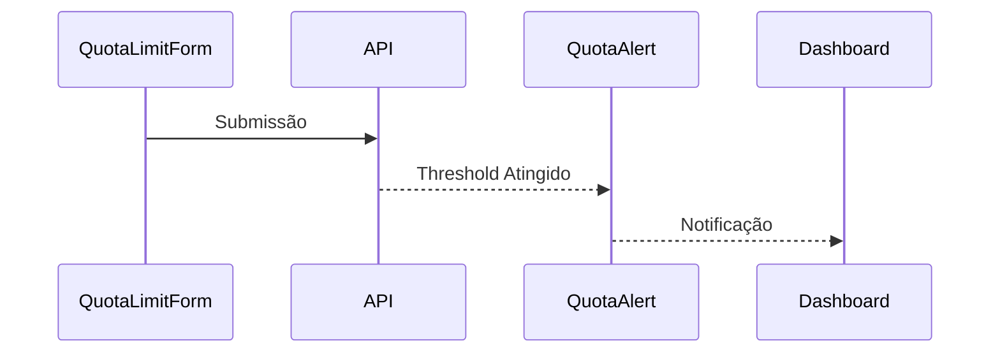

import { Meta } from '@storybook/blocks';
import { StatCard } from '../components/dashboard/stat-card';
import { QuotaAlert } from '../components/quotas/quota-alert';
import { QuotaUsageRing } from '../components/quotas/quota-usage-ring';

<Meta title="Documentação/Componentes" />

# Componentes do LLManager

O LLManager utiliza um conjunto de componentes reutilizáveis para criar uma experiência consistente.

## Hierarquia de Componentes



## Fluxo de Dados

Os componentes seguem um padrão unidirecional de dados, onde:

1. Estado global é gerenciado via Zustand
2. Queries e mutations são feitas via React Query
3. Props são passadas de cima para baixo
4. Eventos são emitidos de baixo para cima

## Principais Componentes

### StatCard
Usado para exibir métricas principais do dashboard.
```jsx
<StatCard
  title="Total de Tokens"
  value={1234}
  icon={<Icon />}
  trend={{ value: 12, isPositive: true }}
/>
```

### QuotaAlert
Notifica usuários sobre limites de quota atingidos.
```jsx
<QuotaAlert
  alert={{
    id: '1',
    threshold: 90,
    triggered: true
  }}
  onDismiss={(id) => {}}
/>
```

### QuotaUsageRing
Visualização do consumo de quotas.
```jsx
<QuotaUsageRing
  title="Uso de Tokens"
  used={800}
  total={1000}
  unit="tokens"
/>
```

### QuotaLimitForm
Formulário para configuração de limites.
```jsx
<QuotaLimitForm
  onSubmit={async (data) => {}}
  onCancel={() => {}}
/>
```

## Padrões de Estado

1. **Loading States**
   - Skeletons para carregamento inicial
   - Spinners para ações
   - Feedback visual imediato

2. **Error States**
   - Mensagens de erro contextuais
   - Fallbacks visuais
   - Retry mechanisms

3. **Empty States**
   - Mensagens informativas
   - Ações sugeridas
   - Ilustrações quando apropriado

## Interações entre Componentes

### Dashboard


### Quotas


## Boas Práticas

1. **Composição**
   - Componentes pequenos e focados
   - Reutilização via composição
   - Props bem definidas

2. **Performance**
   - Memoização quando necessário
   - Lazy loading de componentes pesados
   - Otimização de re-renders

3. **Acessibilidade**
   - ARIA labels
   - Suporte a teclado
   - Temas alto contraste

## Testes

Cada componente possui:
- Testes unitários (Jest)
- Testes de integração (Testing Library)
- Histórias do Storybook
- Testes E2E (Cypress)