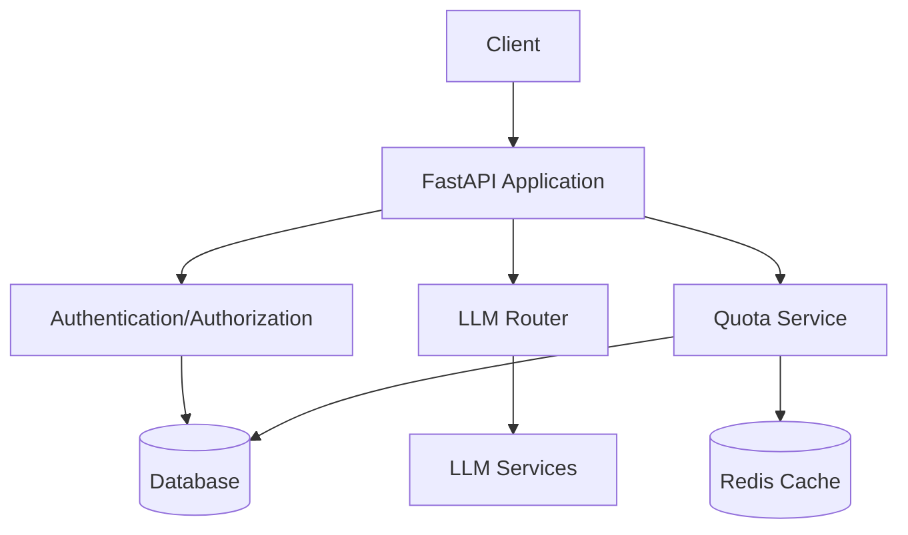
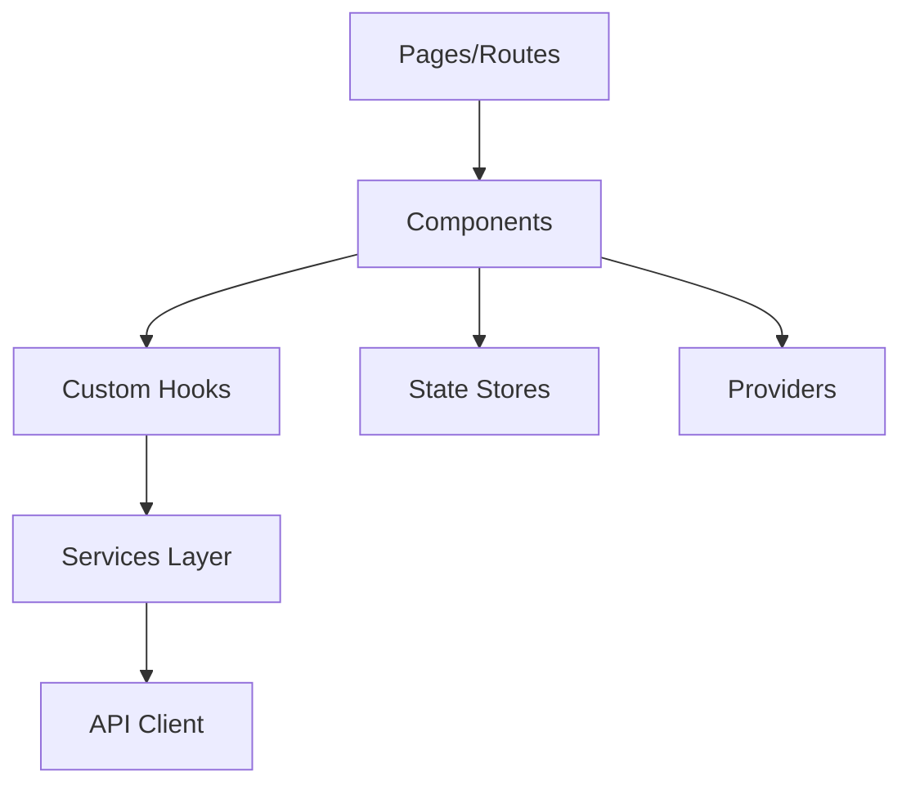

# System Patterns

## Architecture Overview

### Backend Architecture (Python/FastAPI)

### Frontend Architecture (Next.js)

## Design Patterns

### Backend Patterns
1. Repository Pattern
   - Database abstraction through models
   - Separation of data access logic

2. Service Layer Pattern
   - Business logic encapsulation
   - Services for quotas, models, etc.

3. Middleware Chain
   - Authentication
   - Request validation
   - Quota enforcement
   - Error handling

4. Factory Pattern
   - App configuration and setup
   - Component initialization

### Frontend Patterns
1. Component Composition
   - Reusable UI components
   - Layout components
   - Feature-specific components

2. Custom Hooks
   - API interaction hooks
   - Authentication hooks
   - State management hooks

3. Provider Pattern
   - Authentication context
   - Theme management
   - Query client provider

4. Service Layer
   - API communication abstraction
   - Business logic separation

## Key Technical Decisions

### Backend
1. FastAPI Framework
   - Modern async support
   - Automatic OpenAPI docs
   - Type validation with Pydantic

2. SQLAlchemy ORM
   - Database abstraction
   - Migration support
   - Transaction management

3. Redis Caching
   - Quota tracking
   - Performance optimization

4. Alembic Migrations
   - Database version control
   - Schema evolution

### Frontend
1. Next.js Framework
   - Server-side rendering
   - API routes
   - TypeScript support

2. TailwindCSS
   - Utility-first styling
   - Consistent design system

3. React Query
   - Data fetching
   - Cache management
   - Server state sync

## Component Relationships
1. Authentication Flow
   - Login/Register pages
   - Auth middleware
   - Token management
   - Permission checks

2. API Key Management
   - Key generation
   - Usage tracking
   - Quota enforcement

3. Request Pipeline
   - Authentication
   - Quota verification
   - Request routing
   - Response handling

4. Monitoring System
   - Metrics collection
   - Grafana integration
   - Prometheus metrics
   - Usage analytics